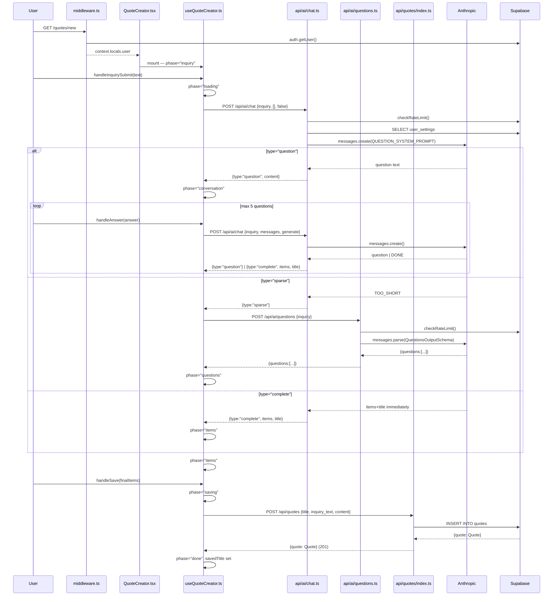

# Research: useQuoteCreator Refactor

**Date**: 2026-06-15
**Git Commit**: `3c9a5afa`
**Branch**: main

## Research Question

Przeanalizuj przepływ `useQuoteCreator` w całości: e2e trace od entry pointu przez warstwy do zapisu i z powrotem; luki w testach; blast radius przy zmianie. Skup się wyłącznie na stanie obecnym.

---

## Feature Overview

`useQuoteCreator.ts` jest centralnym hookiem przepływu tworzenia wyceny. Orchestruje konwersację AI-wspomaganą, w której użytkownik opisuje projekt, AI zadaje pytania doprecyzowujące, a następnie generuje pozycje wyceny, które użytkownik może edytować przed zapisem.

### Entry point

**Evidence** — `src/pages/new.astro:7–12` montuje `<QuoteCreator client:load />` bez przekazywania props. Komponent jest w pełni hydratowany po stronie klienta. Middleware (`src/middleware.ts:8–17`) ustala sesję użytkownika przez Supabase przed dotarciem requesta do strony.

### Rzeczywista sekwencja API calls — różna od założenia w `change.md`

**Evidence** — pierwsze wywołanie to `POST /api/ai/chat` (nie `/api/ai/questions`). `/api/ai/questions` jest wywoływany tylko w ścieżce "sparse".

```
handleInquirySubmit
  └─ callChat(inquiry, [], generate=false)  →  POST /api/ai/chat
       ├─ response.type === "question"       →  conversationLoop
       │    └─ handleAnswer × N
       │         └─ callChat(inquiry, messages, generate=false|true)  →  POST /api/ai/chat
       │              └─ response.type === "complete"  →  phase="items"
       ├─ response.type === "sparse"         →  callQuestions(inquiry)  →  POST /api/ai/questions
       │    └─ phase="questions"
       └─ response.type === "complete"       →  phase="items" (skip conversation)

phase="items"
  └─ handleSave(finalItems)  →  POST /api/quotes
       └─ phase="done"
```

Realny przepływ — `src/components/hooks/useQuoteCreator.ts:67–109` — ma cztery rozgałęzienia przy pierwszym wywołaniu, nie trzy kroki sekwencyjne.

### Sekwencja kroków z file:line

| #   | Krok                                                                                         | Plik:linia                                      |
| --- | -------------------------------------------------------------------------------------------- | ----------------------------------------------- |
| 1   | User → `/quotes/new` → middleware ustala `context.locals.user`                               | `middleware.ts:8–17`                            |
| 2   | Astro montuje `<QuoteCreator client:load />`                                                 | `pages/new.astro:7–12`                          |
| 3   | Hook inicjalizuje: `phase="inquiry"`, 12 pustych stanów                                      | `useQuoteCreator.ts:41–53`                      |
| 4   | Użytkownik submit → `InquiryForm.tsx:35–48` → `handleInquirySubmit(text)`                    | `useQuoteCreator.ts:67`                         |
| 5   | `phase="loading"`, `callChat(text, [], false)`                                               | `useQuoteCreator.ts:70–72`                      |
| 6   | `POST /api/ai/chat` — auth check, rate limit, Supabase `user_settings`, Anthropic call       | `api/ai/chat.ts:78–220`                         |
| 7a  | Odpowiedź `type="question"` → `currentQuestion`, `questionCount=1`, `phase="conversation"`   | `useQuoteCreator.ts:102–104`                    |
| 7b  | Odpowiedź `type="sparse"` → `callQuestions` → `POST /api/ai/questions` → `phase="questions"` | `useQuoteCreator.ts:82–94`                      |
| 7c  | Odpowiedź `type="complete"` → `items`, `title`, `phase="items"` (skip rozmowy)               | `useQuoteCreator.ts:96–100`                     |
| 8   | Pętla: user odpowiada → `handleAnswer` → `callChat(inquiry, messages, generate)`             | `useQuoteCreator.ts:111–148`                    |
| 9   | Po `MAX_QUESTIONS=5` lub DONE: `generate=true` → API generuje `items`                        | `useQuoteCreator.ts:119–121`, `chat.ts:143–164` |
| 10  | `phase="items"` → user edytuje w `LineItemsEditor` → `handleSave`                            | `useQuoteCreator.ts:197–213`                    |
| 11  | `POST /api/quotes` — auth, Supabase INSERT, `status='draft'`                                 | `api/quotes/index.ts:50–54`                     |
| 12  | `phase="done"`, `savedTitle` ustawione                                                       | `useQuoteCreator.ts:207–208`                    |

### Kształty kontraktów HTTP

**Evidence** — analiza kodu źródłowego:

#### `POST /api/ai/questions`

```typescript
// Request (useQuoteCreator.ts:23, questions.ts:10–14)
{ inquiry_text: string }  // API: min(3); hook: brak walidacji min

// Response (questions.ts:104)
{ questions: string[] }   // 5–7 pytań
```

#### `POST /api/ai/chat`

```typescript
// Request (useQuoteCreator.ts:35, chat.ts:11–15)
{ inquiry_text: string; messages: Message[]; generate: boolean }
// API: inquiry_text min(20); hook: brak walidacji min

// Response (chat.ts:161, 186, 210, 216)
| { type: "question"; content: string }
| { type: "sparse" }
| { type: "complete"; items: QuoteItem[]; title: string }
| { error: string }  // dowolny komunikat błędu, tylko przy status 422
```

#### `POST /api/quotes`

```typescript
// Request (useQuoteCreator.ts:204, quotes/index.ts:8–12)
{ title: string; inquiry_text: string; content: { items: QuoteItem[] } }

// Response (quotes/index.ts:63) — hook nigdy nie czyta
{ quote: Quote }  // pełny rekord z DB (id, user_id, status, created_at, updated_at)
```

### Diagram sekwencyjny



---

## Technical Debt

### TD-1 — Hardcoded URL strings bez typowania

**Evidence** — trzy literały w `useQuoteCreator.ts`:

- L20: `"/api/ai/questions"`
- L32: `"/api/ai/chat"`
- L201: `"/api/quotes"`

**Evidence** — testy (`useQuoteCreator.test.ts`) mockują `global.fetch` bez asercji na URL, więc zmiana URL-i nie złamie testów — błąd pojawi się dopiero w runtime.

**Inference** — każda zmiana nazwy route wymaga `grep` zamiast refaktoru TypeScript. Ryzyko wzrośnie przy dodaniu kolejnych hooków lub stron korzystających z tych samych endpoints.

---

### TD-2 — Brak typowanych kontraktów HTTP (request/response)

**Evidence** — `ChatResponse` union jest zdefiniowany tylko po stronie hooka (`useQuoteCreator.ts:5–9`). API (`chat.ts`) zwraca te same kształty bez wspólnego źródła prawdy.

**Evidence** — kontrakt `/api/ai/questions` jest w hooku: `data.questions` cast przez `Array.isArray` (`useQuoteCreator.ts:26–28`), bez TypeScript type. API zwraca `{ questions: string[] }` bez eksportu tego typu.

**Evidence** — POST `/api/quotes` response (`{ quote: Quote }`) jest całkowicie ignorowany przez hook (`useQuoteCreator.ts:206` — tylko `res.ok` check). `id` stworzonej wyceny jest tracone.

**Inference** — zmiana kształtu response w którymkolwiek route nie spowoduje błędu kompilacji po stronie hooka.

---

### TD-3 — Niezgodność ograniczeń walidacyjnych client/server

**Evidence** — `inquiry_text` w `POST /api/ai/chat`:

- API: `z.string().min(20)` (`chat.ts:12`)
- Hook: brak walidacji min (`useQuoteCreator.ts:35` — wysyła bez sprawdzenia)

**Evidence** — `inquiry_text` w `POST /api/ai/questions`:

- API: `z.string().min(3)` (`questions.ts:13`)
- Hook: brak walidacji min (`useQuoteCreator.ts:23`)

**Inference** — naruszenie min(20) w `callChat` daje HTTP 400. Hook traktuje to jak błąd sieciowy (`useQuoteCreator.ts:37`: `if (!res.ok && res.status !== 422) throw`), user widzi "Błąd połączenia z AI." zamiast "Zapytanie jest za krótkie."

---

### TD-4 — handleSave ignoruje ID stworzonej wyceny

**Evidence** — `api/quotes/index.ts:63` zwraca `{ quote: Quote }` z pełnym rekordem DB (zawiera `id`). Hook (`useQuoteCreator.ts:206`) sprawdza tylko `res.ok`, nie czyta body.

**Evidence** — po zapisie hook ustawia `savedTitle` i `phase="done"`. Ekran sukcesu (`QuoteCreator.tsx:39–51`) pokazuje link do `/quotes` (lista wszystkich wycen), nie do `/quotes/:id` (konkretna wycena).

**Inference** — użytkownik po zapisie nie może przejść bezpośrednio do stworzonej wyceny. Aby to umożliwić bez refaktoru hooka, trzeba by było dodać dodatkowy fetch lub przekazać ID przez inny mechanizm.

---

### TD-5 — Stuck state: brak ścieżki ucieczki z "conversation" przy `inquiry_unusable`

**Evidence** — `chat.ts:154–159`: gdy `generateItems` zwraca pustą tablicę, API odpowiada HTTP 422 z `{ error: "inquiry_unusable" }`.

**Evidence** — `useQuoteCreator.ts:37`: `callChat` przepuszcza 422 (nie rzuca), więc `handleAnswer` (L125) otrzymuje `{ error: "inquiry_unusable" }` jako dane, ustawia error message i wraca do `phase="conversation"`.

**Evidence** — `QuoteCreator.tsx:68–86`: `ConversationCard` nie ma przycisku "wróć" ani "resetuj". Jedyne wyjście ze stuck state to reload strony.

**Inference** — stan ten jest mało prawdopodobny w praktyce (AI rzadko zwraca 0 pozycji po długiej rozmowie), ale nie jest niemożliwy. Brak testy dla tej ścieżki (Agent 2 potwierdza: NOT COVERED).

---

### TD-6 — handleSkip, handleGenerateQuestions, handleBackFromQuestions — zero pokrycia testami

**Evidence** — `useQuoteCreator.ts:150–195` — trzy callbacki bez ani jednego testu. `useQuoteCreator.test.ts` nie referuje żadnej z tych funkcji.

**Evidence** — `handleSkip` (L150–173) wywołuje `callChat` z `generate=true` — to jest krytyczna ścieżka: pozwala użytkownikowi pominąć pytania i od razu wygenerować pozycje. Brak testu oznacza, że regresja w tej funkcji nie jest wykrywalna.

**Inference** — przy refaktorze interfejsu hooka te trzy funkcje mają wysokie ryzyko cichego złamania.

---

### TD-7 — QuoteCreator.tsx: brak jakichkolwiek testów komponentowych

**Evidence** — nie istnieje żaden plik `QuoteCreator.test.tsx`. Analiza `src/__tests__/` i `vitest.config.ts` nie wykazała żadnego setup dla komponentów React.

**Evidence** — `QuoteCreator.tsx:12–35` destrukturuje 11 stanów i 9 akcji z hooka. Każda zmiana kształtu API hooka wymaga ręcznej weryfikacji, że komponent nadal poprawnie renderuje wszystkie 7 faz.

**Inference** — refaktor interfejsu hooka (zmiana nazw, podział, nowe typy) jest operacją bez siatki bezpieczeństwa dla UI.

---

### TD-8 — Rate limiting: podwójna warstwa z asymetrycznym zachowaniem

**Evidence** — `middleware.ts:19–27`: pre-flight check dla `/api/ai/*` przed logiką API. Zwraca 429 z `Retry-After` header jako response.

**Evidence** — `chat.ts:86–95`, `questions.ts:41–50`, `scope.ts:47`: każdy route `/api/ai/*` sprawdza rate limit ponownie wewnątrz handlera.

**Evidence** — hook wykrywa 429 przez string match: `useQuoteCreator.ts:16` — funkcja `is429(err)` sprawdza `err.message === "HTTP 429"`. Middleware 429 jest traktowany inaczej niż API 429 (jeden jest throw, drugi jest response).

**Inference** — jeśli middleware 429 jest rzucane jako exception a API 429 jako response z `res.ok=false`, oba ścieżki mogą prowadzić do różnych komunikatów błędu dla użytkownika. Nie można tego potwierdzić z samego grafu importów.

---

## Pokrycie testów — mapa

### useQuoteCreator.ts

| Funkcja / ścieżka                          | Status         | Plik:linia dowodu               |
| ------------------------------------------ | -------------- | ------------------------------- |
| `callQuestions` — success                  | ✅ COVERED     | `useQuoteCreator.test.ts:225`   |
| `callQuestions` — 429                      | ✅ COVERED     | `useQuoteCreator.test.ts:90`    |
| `callChat` — question response             | ✅ COVERED     | `useQuoteCreator.test.ts:41`    |
| `callChat` — complete response             | ✅ COVERED     | `useQuoteCreator.test.ts:106`   |
| `callChat` — 422 pass-through              | ❌ NOT COVERED | `useQuoteCreator.ts:37`         |
| `handleInquirySubmit` — happy path         | ✅ COVERED     | `useQuoteCreator.test.ts:41–45` |
| `handleInquirySubmit` — sparse → questions | ✅ COVERED     | `useQuoteCreator.test.ts:191`   |
| `handleInquirySubmit` — complete (skip)    | ✅ COVERED     | `useQuoteCreator.test.ts:199`   |
| `handleInquirySubmit` — `inquiry_unusable` | ❌ NOT COVERED | `useQuoteCreator.ts:75–76`      |
| `handleAnswer` — question loop             | ✅ COVERED     | `useQuoteCreator.test.ts:153`   |
| `handleAnswer` — MAX_QUESTIONS trigger     | ✅ COVERED     | `useQuoteCreator.test.ts:237`   |
| `handleAnswer` — network error             | ✅ COVERED     | `useQuoteCreator.test.ts:37–59` |
| `handleSkip` — cała funkcja                | ❌ NOT COVERED | `useQuoteCreator.ts:150–173`    |
| `handleGenerateQuestions`                  | ❌ NOT COVERED | `useQuoteCreator.ts:175–190`    |
| `handleBackFromQuestions`                  | ❌ NOT COVERED | `useQuoteCreator.ts:192–195`    |
| `handleSave` — success                     | ✅ COVERED     | `useQuoteCreator.test.ts:162`   |
| `handleSave` — error                       | ✅ COVERED     | `useQuoteCreator.test.ts:92`    |
| `handleSave` — re-entry guard              | ✅ COVERED     | `useQuoteCreator.test.ts:278`   |

### QuoteCreator.tsx

**❌ Brak jakichkolwiek testów komponentowych.**

### API routes (izolowane)

- `/api/ai/chat`, `/api/ai/questions`, `/api/quotes` — branches testowane **wyłącznie przez mocked fetch** w `useQuoteCreator.test.ts`. Żaden handler nie ma testu jednostkowego/integracyjnego.
- Wyjątek: error sanitization (`src/__tests__/error-sanitization/`) — sprawdza, że klucze API nie wyciekają w odpowiedziach błędu.
- `src/__tests__/rate-limiting/` — testuje `lib/rate-limit.ts` jednostkowo.
- `src/__tests__/access-control/` — testuje RLS na poziomie Supabase, nie HTTP handlers.

---

## Blast Radius

### Pliki które MUSZĄ zmienić się przy refaktorze

| Plik                                      | Powód                                                                                        | Typ zmiany |
| ----------------------------------------- | -------------------------------------------------------------------------------------------- | ---------- |
| `src/components/hooks/useQuoteCreator.ts` | Cel refaktoru — ekstrakcja URL jako stałych, typowanie kontraktów                            | Refaktor   |
| `src/types.ts`                            | Dodanie `QuestionsRequest`, `QuestionsResponse`, `ChatRequest`, przeniesienie `ChatResponse` | Addytywna  |

### Pliki które PRAWDOPODOBNIE zmienią się

| Plik                                           | Powód                                                                  | Git co-changes |
| ---------------------------------------------- | ---------------------------------------------------------------------- | -------------- |
| `src/components/hooks/useQuoteCreator.test.ts` | Zmiana strategii mockowania (fetch mock → module mock jeśli API layer) | —              |
| `src/components/quotes/QuoteCreator.tsx`       | Jedyny consumer hooka; zmiana kształtu API hooka = zmiana tutaj        | 3–4× co-change |
| `src/pages/api/ai/chat.ts`                     | Import shared `ChatRequest`/`ChatResponse`                             | 1× co-change   |
| `src/pages/api/ai/questions.ts`                | Import shared `QuestionsRequest`/`QuestionsResponse`                   | 2× co-change   |
| `src/pages/api/quotes/index.ts`                | Import shared `QuoteCreateRequest`                                     | 1× co-change   |

### Pliki które MOGĄ zmienić się (scope creep)

| Plik                                            | Warunek                                            |
| ----------------------------------------------- | -------------------------------------------------- | ------------ |
| `src/components/quotes/InquiryForm.tsx`         | Zmiana sygnatury `handleInquirySubmit`             | 4× co-change |
| `src/components/quotes/LineItemsEditor.tsx`     | Zmiana `QuoteItem` type lub `handleSave` sygnatury | 4× co-change |
| `src/components/quotes/ConversationCard.tsx`    | Zmiana `Message` type lub phase-gated props        | 3× co-change |
| `src/components/quotes/ClientQuestionsList.tsx` | Zmiana `questions: string[]` prop                  | 3× co-change |
| `src/lib/api-client.ts` (nowy)                  | Jeśli ekstrakcja do osobnego modułu HTTP           | —            |

### DB / migracje

**Evidence** — `supabase/migrations/20260526000000_create_quotes.sql`: INSERT hook wysyła `{ title, inquiry_text, content }`, serwer dodaje `status='draft'` i `user_id`. Schemat tabeli jest kompatybilny. Żadne migracje nie są wymagane przez refaktor.

### Git co-change potwierdzenie

**Evidence** — z git log 9 commitów na `useQuoteCreator.ts`:

| Plik                                                                  | Co-changes | Ocena                                                                        |
| --------------------------------------------------------------------- | ---------- | ---------------------------------------------------------------------------- |
| `InquiryForm.tsx`, `LineItemsEditor.tsx`                              | 4×         | potwierdza blast radius                                                      |
| `QuoteCreator.tsx`, `ConversationCard.tsx`, `ClientQuestionsList.tsx` | 3–4×       | potwierdza blast radius                                                      |
| `useQuotesList.ts`                                                    | 3×         | **nieoczekiwany** — sibling hook, zmieniano w tych samych PR-ach niezależnie |
| `src/types.ts`                                                        | 2×         | potwierdza blast radius                                                      |
| `api/ai/questions.ts`                                                 | 2×         | potwierdza blast radius                                                      |

---

## Dowody vs Interpretacja vs Białe plamy

### Evidence (bezpośrednie dowody z kodu)

- Wszystkie hardcoded URL strings z numerami linii
- Kształty request/response bodies z kodu źródłowego i Zod schemas
- Pokrycie testów z odniesieniem do konkretnych testów
- Schemat tabeli `quotes` z pliku migracji
- Git co-change data z `git log`

### Inference (interpretacja dowodów)

- Użytkownik widzi "Błąd połączenia z AI" zamiast "Zbyt krótkie zapytanie" przy HTTP 400 — logika jest widoczna w kodzie, ale nie ma testu który to weryfikuje
- Stuck state w ConversationCard przy `inquiry_unusable` — mechanizm potwierdzony, prawdopodobieństwo wystąpienia nieznane
- `useQuotesList.ts` jest nieoczekiwanym co-changerem — najprawdopodobniej niezwiązany architektonicznie, zmieniano razem przez wspólne przeglądy kodu

### Unknown (białe plamy)

- **`src/pages/api/ai/scope.ts`** — plik istnieje w katalogu `api/ai/`, nie jest wołany przez `useQuoteCreator`. Używa `checkRateLimit` (L47) — nie jest martwym kodem, obsługuje osobny przepływ. Nie zbadano, które UI go wywołuje.
- **Zachowanie przy wielokrotnym kliknięciu "Odpowiedz"** — hook ma guard `phase === "loading"` pośrednio przez `isLoading` w `QuoteCreator.tsx:37`, ale brak testu race condition.
- **Zachowanie middleware 429 vs API 429** — oba powinny wyzwolić `is429()`, ale kod middleware jest inaczej strukturyzowany niż API. Nie weryfikowano eksperymentalnie.
- **Koszt AI na środowisku testowym** — nie wiadomo, czy `lib/anthropic.ts` ma flagę dla testu. Testy `error-sanitization` mogą wołać prawdziwego Anthropica.
- **`src/pages/api/quotes/[id].ts`** — hook nie woła tego route'a, ale jest kluczowy dla widoku szczegółów wyceny. Poza zakresem tej analizy.

---

## Open Questions

1. Czy `handleSkip` jest w ogóle dostępny z UI? `ConversationCard` przyjmuje `onSkip` prop (`QuoteCreator.tsx:78`), ale czy przycisk Skip jest widoczny użytkownikowi?
2. Czy `src/pages/api/ai/scope.ts` jest wołany z gdziekolwiek w UI — czy można go usunąć?
3. Czy testy `error-sanitization` wołają prawdziwego Anthropica czy mockują moduł?
4. Po refaktorze: czy hook ma zwracać `savedQuoteId` tak, żeby `QuoteCreator.tsx` mógł przekierować do `/quotes/:id`?

---

## Code References

- [`src/components/hooks/useQuoteCreator.ts:20`](https://github.com/mbkosik/quotekit/blob/3c9a5afa3011582e74c6399c3bb060791ede6ee4/src/components/hooks/useQuoteCreator.ts#L20) — hardcoded `/api/ai/questions`
- [`src/components/hooks/useQuoteCreator.ts:32`](https://github.com/mbkosik/quotekit/blob/3c9a5afa3011582e74c6399c3bb060791ede6ee4/src/components/hooks/useQuoteCreator.ts#L32) — hardcoded `/api/ai/chat`
- [`src/components/hooks/useQuoteCreator.ts:201`](https://github.com/mbkosik/quotekit/blob/3c9a5afa3011582e74c6399c3bb060791ede6ee4/src/components/hooks/useQuoteCreator.ts#L201) — hardcoded `/api/quotes`
- [`src/components/hooks/useQuoteCreator.ts:5–9`](https://github.com/mbkosik/quotekit/blob/3c9a5afa3011582e74c6399c3bb060791ede6ee4/src/components/hooks/useQuoteCreator.ts#L5) — `ChatResponse` union (tylko w hooku)
- [`src/components/hooks/useQuoteCreator.ts:37`](https://github.com/mbkosik/quotekit/blob/3c9a5afa3011582e74c6399c3bb060791ede6ee4/src/components/hooks/useQuoteCreator.ts#L37) — 422 pass-through (nieprzetestowane)
- [`src/components/hooks/useQuoteCreator.ts:150–173`](https://github.com/mbkosik/quotekit/blob/3c9a5afa3011582e74c6399c3bb060791ede6ee4/src/components/hooks/useQuoteCreator.ts#L150) — `handleSkip` (brak testów)
- [`src/pages/api/ai/chat.ts:12`](https://github.com/mbkosik/quotekit/blob/3c9a5afa3011582e74c6399c3bb060791ede6ee4/src/pages/api/ai/chat.ts#L12) — `inquiry_text: z.string().min(20)` (niewidoczne dla klienta)
- [`src/pages/api/quotes/index.ts:63`](https://github.com/mbkosik/quotekit/blob/3c9a5afa3011582e74c6399c3bb060791ede6ee4/src/pages/api/quotes/index.ts#L63) — response z `id` ignorowane przez hook
- [`src/pages/new.astro:7–12`](https://github.com/mbkosik/quotekit/blob/3c9a5afa3011582e74c6399c3bb060791ede6ee4/src/pages/new.astro#L7) — entry point

---

## Historical Context

Poprzednia lekcja z `context/foundation/lessons.md` potwierdza kierunek refaktoru:

> **"Logika state machine komponentu trafia do hooka, nie do komponentu"** (2026-05-29) — implementacja `ai-quote-creation-flow` już wyciągnęła state machine do `useQuoteCreator.ts`. Ten refaktor idzie o krok dalej: wyciąga kontrakty HTTP poza hook do warstwy `lib/`.
