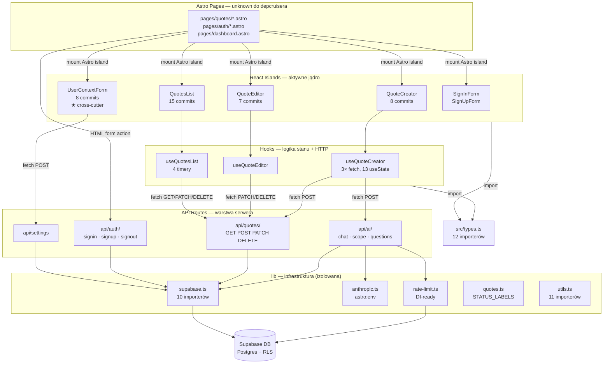

# Repo Map — QuoteKit

> Synteza z dwóch artefaktów: aktywności git (12 miesięcy) i grafu importów TS.
> Dane z 2026-06-15. Czego ta mapa nie widzi — patrz sekcja [Ograniczenia](#ograniczenia).

---

## TL;DR

QuoteKit to aplikacja Astro SSR dla freelancerów, która generuje wyceny wspomagane AI. Użytkownik wypełnia formularz zapytania → AI sugeruje pytania i pozycje wyceny → wycena jest zapisywana, edytowana i wysyłana klientowi.

Serce systemu leży w `src/components/quotes/` — ten folder dotknęło 73% wszystkich commitów z ostatniego roku. Rzeczywista logika biznesowa siedzi w hookach (`useQuoteCreator`, `useQuoteEditor`, `useQuotesList`), które komunikują się z serwerem wyłącznie przez `fetch()` do własnych API routes — nie przez bezpośrednie importy Supabase. Infra (`lib/`) jest stabilna i izolowana. Graf importów jest acykliczny.

Dwa miejsca, które zaskakują nowych developerów: (1) `UserContextForm` jest najaktywniejszym cross-cutterem w git, ale w grafie TS ma zero importerów — jego coupling biegnie przez Astro pages, niewidoczne dla analizy statycznej. (2) Auth komponenty nie wołają API przez JS — używają HTML `<form action>`, co oznacza, że zmiana URL route logowania nie jest sprawdzalna przez TypeScript.

Strzałki `mount` i `HTML form action` z sekcji Astro Pages są **niewidoczne dla TypeScript** — wiemy o nich z kodu źródłowego i historii git, nie z grafu importów.

---

## Teren

### Gdzie skupia się praca

Aktywność commitów z 12 miesięcy jest silnie skoncentrowana:

| Strefa                          | Commits | Charakter                                                   |
| ------------------------------- | ------- | ----------------------------------------------------------- |
| `src/components/quotes/`        | 73      | Jądro systemu — tutaj trwa ciągły feature-churn             |
| `src/components/hooks/`         | 24      | Logika stanu; zmienia się razem z quotes (12× co-change)    |
| `src/pages/api/ai/`             | 14      | Endpointy AI — aktywne niezależnie                          |
| `src/lib/`                      | 15      | Infra: zmiany głównie testowe i konfiguracyjne, nie feature |
| `src/components/auth/`          | 13      | Stabilizuje się; mało nowych funkcji                        |
| `supabase/migrations/`          | 9       | Osobny sub-system — SQL, RLS, nie ma grafu TS               |
| `src/__tests__/access-control/` | 9       | Testy RLS — tu był push na pokrycie bezpieczeństwa          |

Peryferia (mało commitów, rzadko dotykane): `src/layouts/`, `src/styles/`, `src/components/ui/`, `src/middleware.ts`.

### Moduły głębokie vs płytkie

**Głębokie** (wiele zależności wychodzących, dużo logiki):

- `useQuoteCreator.ts` — 13 useState, 3 fetch do różnych endpoints, orchestruje cały flow tworzenia wyceny
- `useQuotesList.ts` — 12 useState, 4 timery, debounce, paginacja
- `QuoteEditor.tsx` / `QuotesList.tsx` — 8 importów src/ każdy, łączą hook + sub-komponenty + dwie ścieżki do lib

**Płytkie** (mało zależności, czysta odpowiedzialność):

- `lib/quotes.ts` — jedna stała `STATUS_LABELS`, importuje tylko `types.ts`
- `lib/rate-limit.ts` — jedna funkcja, SupabaseClient przez DI
- `useSignInForm.ts` / `useSignUpForm.ts` — tylko React `useState`, zero fetch, zero infra
- `src/types.ts` — liść grafu, 0 importów z src/, 12 importerów

### Aktywność a struktura katalogów

`src/components/settings/` wygląda jak peryferium po nazwie katalogu — w rzeczywistości `UserContextForm.tsx` to najaktywniejszy cross-cutter w repo (zmienia się w commitach dotykających średnio 4.8 różnych katalogów). To nie są "ustawienia" w klasycznym sensie — to konfiguracja kontekstu AI dla flow wyceny.

---

## Realne powiązania

### Co faktycznie zmienia się razem

Para `components/quotes ↔ components/hooks` (12 wspólnych commitów) jest najsilniejszym sprzężeniem w repo.
**Źródło wiedzy**: historia git (artifact-1) + potwierdzenie w grafie importów (artifact-2) — każdy hook jest 1:1 z komponentem.

| Para                    | Co-changes | Skąd wiemy                        | Mechanizm                             |
| ----------------------- | ---------- | --------------------------------- | ------------------------------------- |
| `quotes ↔ hooks`        | 12×        | git + import graph                | Hook = dedykowany stan dla komponentu |
| `quotes ↔ settings`     | 7×         | git; **zero importów** w TS graph | Coupling przez Astro pages (unknown)  |
| `hooks ↔ pages/api/ai`  | 4×         | git; **zero importów** w TS graph | Coupling HTTP: fetch do hardcoded URL |
| `auth ↔ quotes`         | 4×         | git; **zero importów** w TS graph | Coupling przez Astro pages (unknown)  |
| `quotes ↔ pages/quotes` | 5×         | git; niewidoczne dla depcruisera  | Mounting komponentów w stronach Astro |

Sprzężenia w kolumnie "zero importów" to coupling **runtime-level**, nie compile-time. TypeScript ich nie sprawdza.

### Cykle

**Brak cykli** w grafie importów TypeScript. Graf jest DAG.

Mimo to granica `components/quotes ↔ components/hooks` jest umowna: żadne narzędzie nie blokuje hooka przed importem komponentu z innej pary. To ryzyko na przyszłość, nie obecny problem.

### Warstwa Astro — martwa strefa analizy statycznej

Pliki `.astro` nie są skanowane przez dependency-cruiser. Oznacza to, że następujące relacje mają status **unknown** w grafie importów:

- Które komponenty są montowane na której stronie
- Jakie props/context jest im przekazywany przez Astro
- Powiązanie `UserContextForm` z flow tworzenia wyceny
- Coupling auth-form → auth-route przez `action="/api/auth/signin"`

Wiemy, że te relacje istnieją — z kodu źródłowego i z git. Ale nie mamy grafu.

### Supabase migrations — osobna warstwa, bez grafu

`supabase/migrations/` to 9 commitów w oknie roku, w tym zmiany RLS i schematu tabel. **Nie ma grafu zależności SQL** — nie wiadomo, które migracje dotykają tych samych tabel co API routes w TS. Przy zmianie schematu trzeba ręcznie śledzić, które route'y są dotknięte.

### Asymetria: podwójne źródło wiedzy domenowej

`QuoteEditor.tsx` i `QuotesList.tsx` importują `lib/quotes.ts` bezpośrednio, pomijając swoje hooki. Hooki nie importują `lib/quotes.ts`. Efekt: zmiana `QuoteStatus` wymaga trzech zsynchronizowanych edycji: `types.ts` → `lib/quotes.ts` (STATUS_LABELS) → komponent. TypeScript sprawdzi typy, ale nie sprawdzi, czy STATUS_LABELS jest aktualny.

---

## Strefy ryzyka

**1. `useQuoteCreator.ts` — główny orchestrator, trudny do testowania**
Wołuje 3 endpointy w sekwencji (`/api/ai/questions` → `/api/ai/chat` → `/api/quotes`), zarządza 13 stanami. URL-e hardcoded jako literały. Zmiana nazwy route = ręczny `grep`, nie błąd TS. Test wymaga MSW z co najmniej 3 handlerami.

**2. `UserContextForm.tsx` — cross-cutter niewidoczny dla TypeScript**
Najsilniejszy cross-cutter według git (4.8 dirs/commit), ale 0 importerów w grafie TS. Coupling biegnie przez Astro pages. Zmiana API `settings` lub kształtu danych wymaga śledzenia ścieżki niedostępnej dla statycznej analizy. Jedyny komponent domenowy z `fetch()` i `useEffect` bezpośrednio w sobie, nie w hooku.

**3. Trzy route'y AI — zero izolacji między nimi**
`api/ai/chat.ts`, `api/ai/scope.ts`, `api/ai/questions.ts` mają identyczny zestaw importów infra. Żadna abstrakcja między nimi. Zmiana limitu rate-limitera, modelu Anthropic lub schematu sesji Supabase dotyka wszystkich trzech naraz. Brak wspólnego handlera = trzy miejsca do aktualizacji.

**4. Brak typowanych kontraktów HTTP**
Hooki wołają `fetch('/api/quotes', { body: JSON.stringify({title, inquiry_text, content}) })`. Routes parsują ten body przez Zod. Nie ma wspólnego TS schema importowanego z obu stron. Dodanie pola wymaganego przez Zod w route nie spowoduje błędu kompilacji w hooku.

**5. `src/types.ts` — blast radius 12 modułów**
Zmienia się rzadko (6 commitów, niski avg dirs/commit), ale importuje go 12 modułów — wszystkie hooki quote, kluczowe komponenty i route'y AI. Zmiana sygnatury istniejącego typu jest bezpieczna (TS to wyłapie); _rozszerzenie_ union lub enum (np. nowy `QuoteStatus`) wymaga ręcznej aktualizacji `STATUS_LABELS` w `lib/quotes.ts`.

**6. `useQuotesList.ts` — timing i stan**
Cztery timery (`useRef` na setTimeout) zarządzające debounce, paginacją i komunikatami statusu. Test bez `vi.useFakeTimers()` jest niedeterministyczny. 12 useState'ów oznacza, że asercje na stanie pośrednim mogą być kruche.

---

## Pierwszy dzień

Czytaj w tej kolejności — każdy plik daje warstwę kontekstu do następnego.

**1. `src/types.ts`**
Kontrakt dla całego systemu. `Quote`, `QuoteStatus`, `LineItem`, `Message` — to jest język domeny. Czytaj najpierw.

**2. `src/middleware.ts`**
Cykl życia każdego requestu: tworzenie klienta Supabase, rozwiązywanie sesji, lista chronionych route'ów. Tu widać granicę auth.

**3. `src/components/hooks/useQuoteCreator.ts`**
Centralny orchestrator flow tworzenia wyceny. Widać tu sekwencję AI (questions → chat) i zapis wyceny. Trzy fetch, trzynaście stanów — to jest serce produktu. Czytaj z uwagą na hardcoded URL-e.

**4. `src/pages/api/ai/chat.ts`**
Serwer po drugiej stronie tego fetcha. Zod validation, Supabase auth z `context.locals`, Anthropic call, rate-limit. Jeden handler = pełny obraz warstwy serwerowej AI.

**5. `src/components/quotes/QuoteCreator.tsx`**
UI wokół `useQuoteCreator`. Montuje `InquiryForm`, `ConversationCard`, `LineItemsEditor`, `ClientQuestionsList`. Tu widać jak stan z hooka przepływa przez ekran.

**6. `src/components/settings/UserContextForm.tsx`**
82 linie z `fetch` i `useEffect` bezpośrednio w komponencie. Zrozum, co zapisuje (`/api/settings`) i dlaczego jest montowany na stronach quotes — semantycznie to konfiguracja kontekstu AI dla wyceny, nie ustawienia konta.

**7. `src/lib/supabase.ts`**
Jak tworzony jest klient Supabase: `astro:env/server`, cookie-based sessions. Czytaj razem z `src/__mocks__/astro-env-server.ts` — zobaczysz, jak projekt radzi sobie z platformowymi zależnościami w testach.

**8. `supabase/migrations/` — ostatnie 3 pliki**
Schemat tabel, RLS policies. Bez tego nie wiesz, jakie masz gwarancje bezpieczeństwa na poziomie bazy i które pola są na które route'y dostępne. Uwaga: nie ma grafu łączącego migracje z route'ami TS.

---

## Ograniczenia

**Okno czasowe**: historia git z ostatnich 12 miesięcy (do 2026-06-15). Kod starszy niż rok może mieć inne wzorce aktywności — tego mapa nie rejestruje.

**Zakres grafu importów**: tylko `.ts` i `.tsx` — 47 modułów, 87 krawędzi. Niewidoczne:

- Pliki `.astro` (strony, layouts) — relacje mount/slot/props
- Pliki `.css` — `global.css` jest activenym cross-cutterem w git (6.5 avg dirs/commit, mała próbka), ale bez grafu
- `supabase/migrations/` (SQL) — bez grafu zależności
- Konfiguracje Wrangler/Cloudflare — coupling z `lib/config-status.ts` jest unknown

**Co coupling git mierzy**: współzmienność, nie przyczynowość. Pary katalogów, które zmieniają się razem, mogą być sprzężone logicznie _lub_ mogą być zmieniane razem przez ten sam PR z innych powodów (np. testy, refaktor). Mapa traktuje obie sytuacje jako sprzężenie.

**Co "brak importu" oznacza**: `UserContextForm` z zerową liczbą importerów w grafie TS nie znaczy, że jest nieużywany — znaczy, że jego konsumenci są w `.astro`, poza zasięgiem skanera. Zawsze sprawdzaj oba źródła.

**Co mapa pomija**: runtime behavior (błędy, latencja, kolejność wywołań), dane produkcyjne (jakie quote flows są najpopularniejsze), zmiany infrastrukturalne (Cloudflare Workers config, Supabase project settings).

---

_Źródła: `context/map/artifact-1-territory.md` (git), `context/map/artifact-2-structure.md` (dependency-cruiser)_
